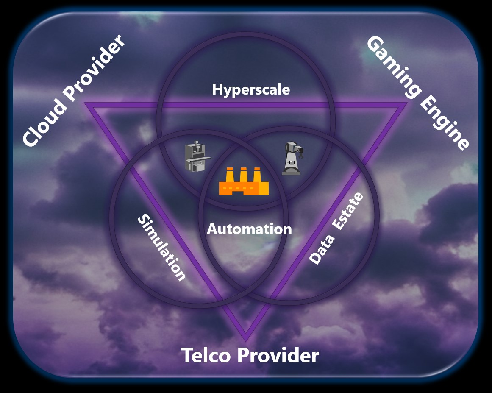

# Thoughts-Industrial-Metaverse
## Thoughts about the Industrial Metaverse from a community perspective

**First** of all the **why**: A vivid community of engaged people want to discuss & share their vast experience to help other companies to accelerate their journey towards digitization and finally to get up to speed in the Industrial Metaverse.  

And to quote **ChatGPT**:
The Industrial Metaverse is important because it enables organizations to create virtual environments that can be used to improve their operations. It allows them to create virtual simulations that can be used to test and develop new products, services, and processes. Additionally, it can be used to provide training and educational opportunities to employees, as well as provide a platform for collaboration and communication between different departments and teams. Finally, it can be used to create virtual experiences that can be used to engage customers and build brand loyalty.
**In other words: it is important and will be the next big thing!!**
   
**2nd** it is natural to start with an overall view and to think about some buildingblocks which are quite important. The following graphic might help to identify some key technologies:

Another teaser for the front page might be to have a quick look of an architecture we are thinking of and which we are going to explain in the architecture session.

A more detailled explanation about our architecture can be found [here](architecture/README.md)
