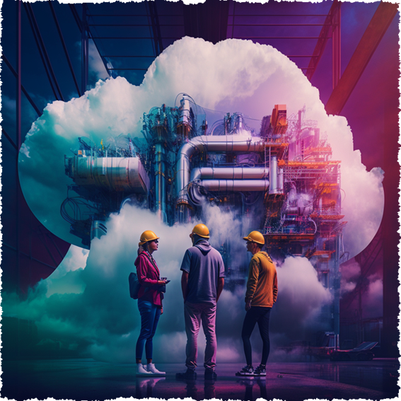
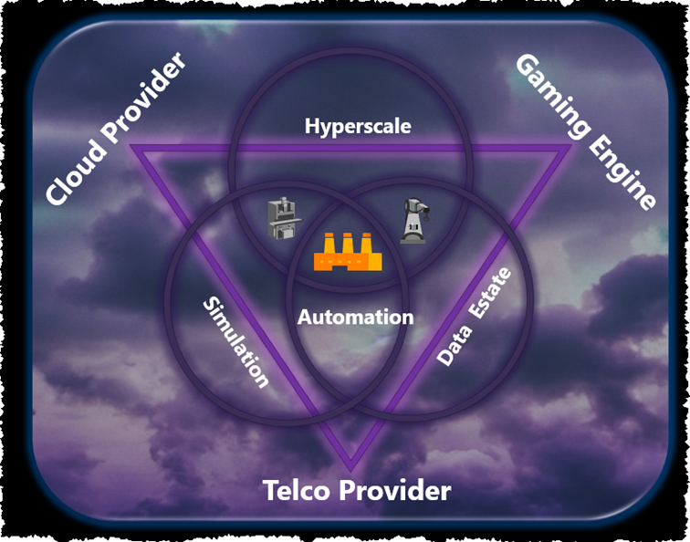

# Thoughts-Industrial-Metaverse
## Thoughts about the Industrial Metaverse from a community perspective

**First** of all the **why**: A vivid community of engaged people wants to discuss & share their vast experience to help others -companies or individuals- to accelerate their journey towards digitization, get a better understanding of that topic and finally to get up to speed in the Industrial Metaverse.  

And to quote **ChatGPT**:
The Industrial Metaverse is important because it enables organizations to create virtual environments that can be used to improve their operations. It allows them to create virtual simulations that can be used to test and develop new products, services, and processes. Additionally, it can be used to provide training and educational opportunities to employees, as well as provide a platform for collaboration and communication between different departments and teams. Finally, it can be used to create virtual experiences that can be used to engage customers and build brand loyalty.
**In other words: it is important and will be the next big thing!!**
   

 
A picture of some architects building the Industrial Metaverse, cloud enabled.

 
**2nd** it is natural to start with an overall view and think about some essential building blocks. The following graphic might help to identify some key technologies which might be essential on the Industrial Metaverse:
  

1. The Cloud Provider
2. Telco Provider
3. Gaming / Rendering Engine

 

If you want to know more, just follow the [link to our overall thoughts](OverallView/README.md)

A more detailled explanation about our architecture thoughts can be found [here](architecture/README.md)
